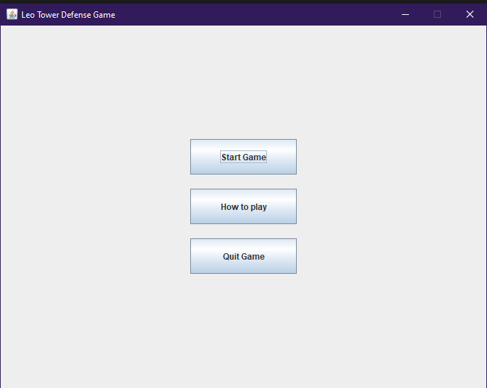

# Remaze Tower Defense Game

During learning java at school, I decided to continue on an existing project. The well known tower defense game that I remade with addons and a little more feel to the design and user interface.

### Getting Started

These instructions below will get you a copy of the project up and running on your local machine. Have fun and enjoy the game.

### Prerequisites

You need to have **Java SDK >= 20** for this project. You can download the SDK from the link below :

[https://oracle.com/java/technologies/downloads/]()

### Installation

* Simply git clone the project. It is written in Java so simply execute the classes.
* Start by running the **Frame.java** program which contains the executable main method to launch the game.

### Example

### Authors

***Basilvetas*** - *Initial Work* - [https://github.com/basilvetas/tower-defense]()

***Ulixava***  - *Tutorials* - [https://www.youtube.com/@Ulixava]()

### License

Copyright © 2023 Hackwrld

Permission is hereby granted, free of charge, to any person obtaining a copy

of this software and associated documentation files (the "Software"), to deal

in the Software without restriction, including without limitation the rights

to use, copy, modify, merge, publish, distribute, sublicense, and/or sell

copies of the Software, and to permit persons to whom the Software is

furnished to do so, subject to the following conditions:

The above copyright notice and this permission notice shall be included in

all copies or substantial portions of the Software.

THE SOFTWARE IS PROVIDED "AS IS", WITHOUT WARRANTY OF ANY KIND, EXPRESS OR

IMPLIED, INCLUDING BUT NOT LIMITED TO THE WARRANTIES OF MERCHANTABILITY,

FITNESS FOR A PARTICULAR PURPOSE AND NONINFRINGEMENT. IN NO EVENT SHALL THE

AUTHORS OR COPYRIGHT HOLDERS BE LIABLE FOR ANY CLAIM, DAMAGES OR OTHER

LIABILITY, WHETHER IN AN ACTION OF CONTRACT, TORT OR OTHERWISE, ARISING FROM,

OUT OF OR IN CONNECTION WITH THE SOFTWARE OR THE USE OR OTHER DEALINGS IN

THE SOFTWARE.

### Acknowledgments

* Thanks alot to **basilvetas**  at [https://github.con/basilvetas]() for the code sample that enabled me to continue and for the videos on the youtube channel for guiding on how to make the basis of the game.
